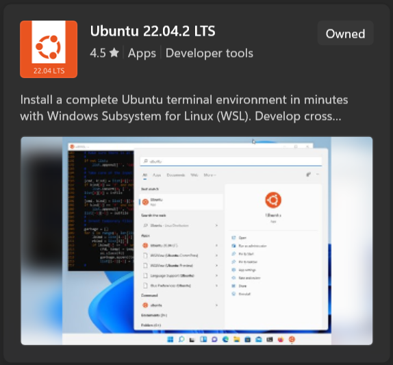

# Ubuntu Virtual Machine (Windows)

You will have to install Ubuntu on your system in order to run our code. Please follow this guide to install Ubuntu virtual machine on your Windows computer using WSL2.

Please contact [Jihwan Ben Shin](mailto:jihwan.shin@sjc.ox.ac.uk) if you have any questions.

## 1. Ubuntu 22.04

### 1.1. Installation

Download Ubuntu 22.04 on your computer using WSL2, following [Ubuntu's tutorial](https://ubuntu.com/tutorials/install-ubuntu-on-wsl2-on-windows-11-with-gui-support#1-overview) until step 4, while making sure you choose **Ubuntu 22.04** from the Microsoft Store.



### 1.2. Usage

Ubuntu 22.04 is a Linux system which uses a language named "bash" on the command line. We recommend that you learn some of the basic commands if you are not familiar. 

Follow [Lorenz Frank's tutorial](https://medium.com/geekculture/basic-bash-commands-c54933183c89) to learn how to navigate within the command line interface. 

It may be helpful to search for more elaborate guides online once you start to get comfortable.

## 2. Visual Studio Code

To edit our code, we recommend using Visual Studio Code. Follow this guide to use this in your Ubuntu virtual machine. 

### 2.1. Installation

Install [Visual Studio Code](https://code.visualstudio.com/) on your Windows local machine. Once installed, open Visual Studio Code to setup your preferences and install the WSL extension to use it with Ubuntu.


### 2.2. Usage

To use Visual Studio Code in your virtual machine, head to your working directory and run the following line of code.

```bash
code .
```

We recommend that you do this in `~/qronk_ws/src` when editing our project as that is where we initialised our git repository.
